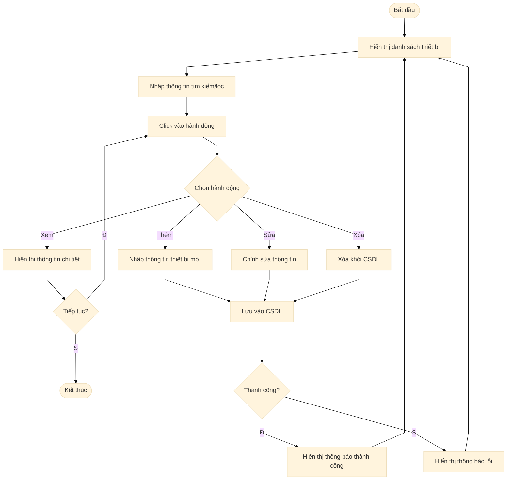

# Lưu đồ CRUD Thiết bị

```mermaid
%%{init: {'theme':'base', 'themeVariables': { 'fontSize':'16px'}, 'flowchart': {'curve': 'linear'}}}%%
flowchart TD
    Start([Bắt đầu])
    Start --> List[Hiển thị danh sách thiết bị]
    List --> Filter[Nhập thông tin tìm kiếm/lọc]
    Filter --> Click[Click vào hành động]
    Click --> Action{Chọn hành động}
    
    Action -->|Xem| View[Hiển thị thông tin chi tiết]
    View --> Continue{Tiếp tục?}
    Continue -->|Đ| Click
    Continue -->|S| End([Kết thúc])
    
    Action -->|Thêm| Add[Nhập thông tin thiết bị mới]
    Add --> Save[Lưu vào CSDL]
    
    Action -->|Sửa| Edit[Chỉnh sửa thông tin]
    Edit --> Save
    
    Action -->|Xóa| Delete[Xóa khỏi CSDL]
    Delete --> Save
    
    Save --> Success{Thành công?}
    Success -->|Đ| SuccessMsg[Hiển thị thông báo thành công]
    Success -->|S| ErrorMsg[Hiển thị thông báo lỗi]
    SuccessMsg --> List
    ErrorMsg --> List
```

*Hình PL.2 Lưu đồ giải thuật chương trình CRUD thiết bị*
