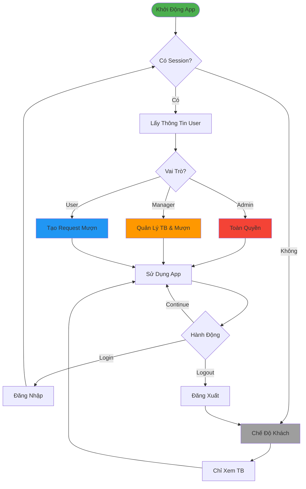

# Luồng Xác Thực và Phân Quyền (Đơn Giản)

## Tóm Tắt

### 4 Cấp Độ Quyền
- **👤 Khách**: Xem thiết bị
- **🔵 User**: Tạo request mượn
- **🟠 Manager**: Quản lý thiết bị & mượn trả
- **🔴 Admin**: Toàn quyền hệ thống

### Quy Trình
1. Kiểm tra session khi khởi động
2. Xác định vai trò nếu đã đăng nhập
3. Cấp quyền theo vai trò
4. Cho phép login/logout bất kỳ lúc nào
