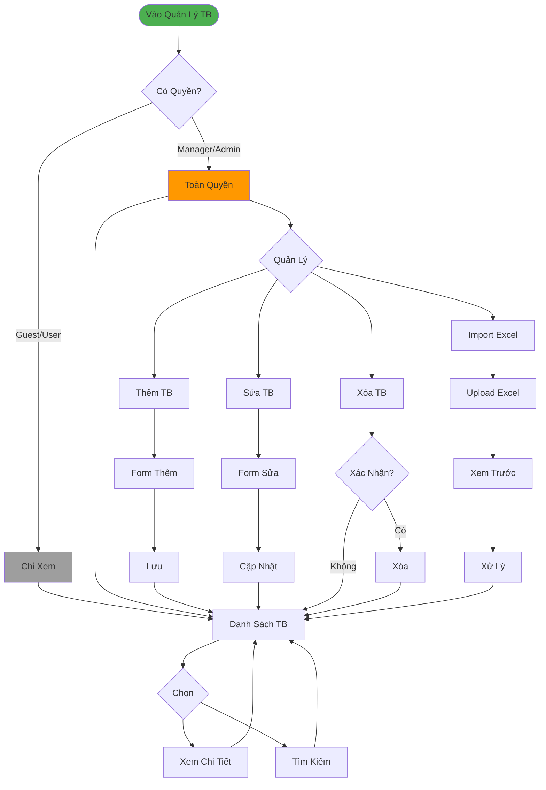

# Luồng Quản Lý Thiết Bị (Đơn Giản)

## Tóm Tắt

### Quyền Truy Cập
- **Guest/User**: Chỉ xem, tìm kiếm
- **Manager/Admin**: CRUD + Import Excel

### Chức Năng Chính
1. **Xem & Tìm**: Danh sách, chi tiết, lọc
2. **Thêm**: Form nhập thông tin + upload ảnh
3. **Sửa**: Cập nhật thông tin
4. **Xóa**: Soft delete có xác nhận
5. **Import**: Upload Excel, preview, xử lý
