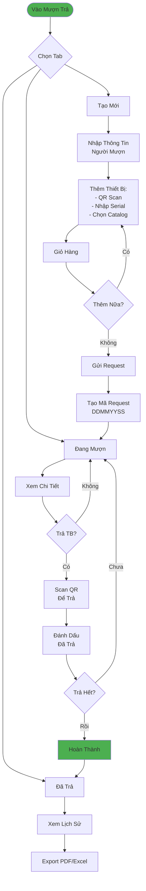

# Luồng Quản Lý Mượn Trả (Đơn Giản)

## Tóm Tắt

### 3 Tab Chính
1. **Đang Mượn**: Request active, quá hạn highlight đỏ
2. **Đã Trả**: Lịch sử hoàn thành
3. **Tạo Mới**: Form tạo request

### Quy Trình Mượn
1. Nhập thông tin người mượn
2. Thêm thiết bị (3 cách: QR/Serial/Catalog)
3. Review giỏ hàng
4. Submit → Tạo mã request (DDMMYYSS)

### Quy Trình Trả
1. Scan QR thiết bị
2. Đánh dấu đã trả
3. Khi trả hết → Hoàn thành request
