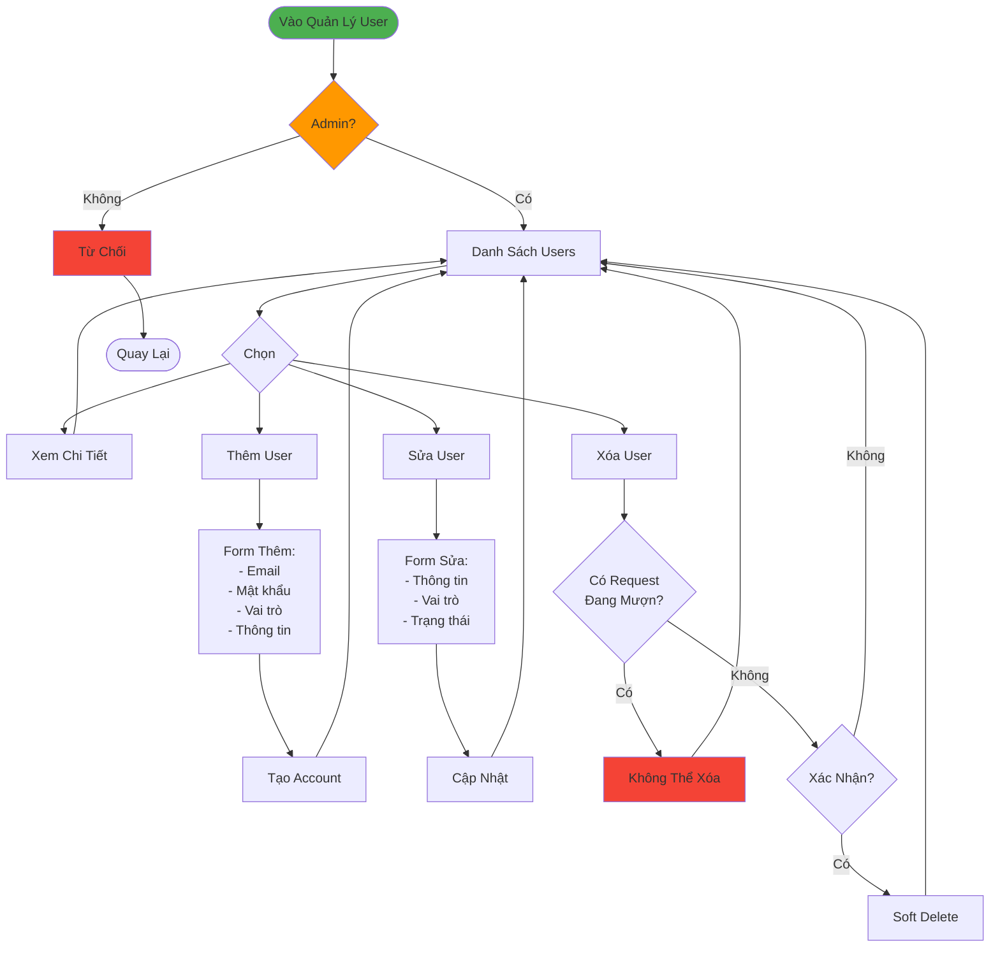

# Luồng Quản Lý Người Dùng (Đơn Giản)

## Tóm Tắt

### Quyền Truy Cập
- **Chỉ Admin** được quản lý users

### Chức Năng CRUD
1. **Thêm**: Tạo account mới với email, password, role
2. **Xem**: Chi tiết user, activity, requests
3. **Sửa**: Cập nhật info, đổi role, active/inactive
4. **Xóa**: Soft delete (không xóa nếu còn request đang mượn)

### Validation
- Email hợp lệ & không trùng
- Password mạnh (8+ ký tự, chữ hoa, số)
- Phone 10 số
- Không xóa chính mình
- Không xóa user có request active
