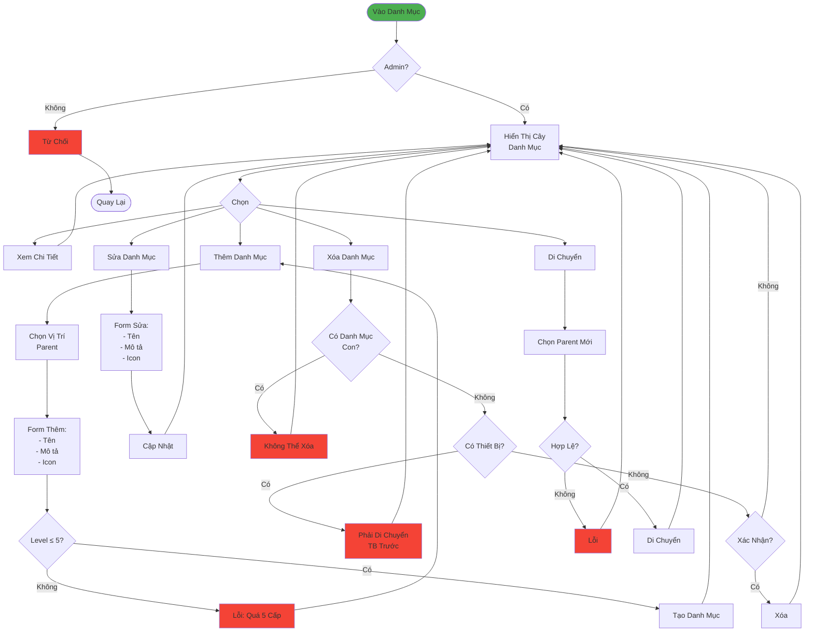

# Luồng Quản Lý Danh Mục (Đơn Giản)

## Tóm Tắt

### Quyền Truy Cập
- **Chỉ Admin** được quản lý danh mục

### Cấu Trúc
- Cây phân cấp tối đa **5 level**
- Mỗi danh mục có: Tên, Mô tả, Icon, Path

### Chức Năng
1. **Thêm**: Tạo danh mục mới (chọn parent)
2. **Sửa**: Đổi tên, mô tả, icon
3. **Xóa**: Không xóa nếu có con hoặc có thiết bị
4. **Di Chuyển**: Thay đổi parent (validate level)
5. **Sắp Xếp**: Drag & drop để đổi thứ tự

### Rules
- Không vượt 5 cấp
- Không trùng tên trong cùng cấp
- Không xóa nếu có con/thiết bị
- Không di chuyển vào chính nó
