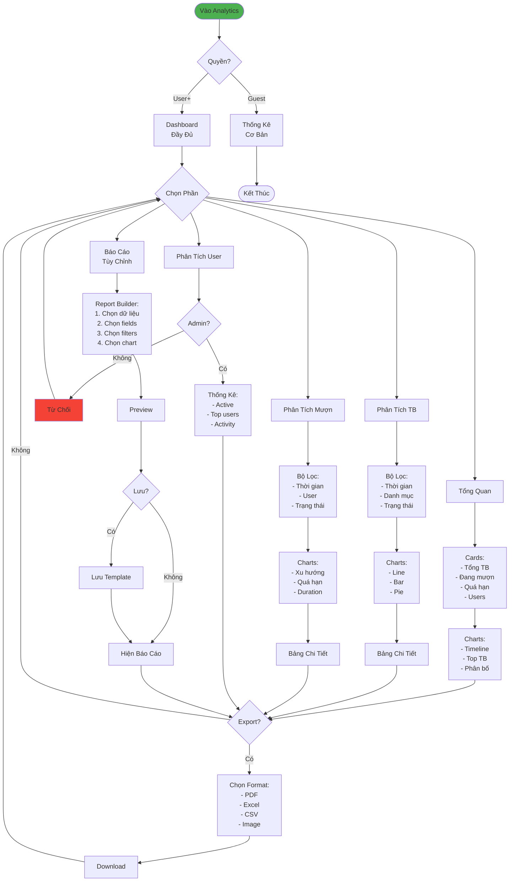

# Luồng Phân Tích & Báo Cáo (Đơn Giản)

## Tóm Tắt

### Quyền Truy Cập
- **Guest**: Thống kê cơ bản
- **User+**: Dashboard đầy đủ
- **Admin**: Thêm phân tích users

### 5 Phần Chính

1. **Tổng Quan**
   - Cards: Số liệu nhanh
   - Charts: Timeline, Top TB, Phân bố

2. **Phân Tích Thiết Bị**
   - Lọc: Thời gian, danh mục, trạng thái
   - Charts: Line, Bar, Pie
   - Bảng chi tiết

3. **Phân Tích Mượn Trả**
   - Xu hướng requests
   - Quá hạn tracking
   - Duration analysis

4. **Phân Tích Users** (Admin)
   - Active users
   - Top borrowers
   - Activity patterns

5. **Báo Cáo Tùy Chỉnh**
   - Report Builder
   - Chọn data, fields, filters, charts
   - Lưu template
   - Schedule auto-generate

### Export
- PDF, Excel, CSV, Image
- Áp dụng cho tất cả reports
