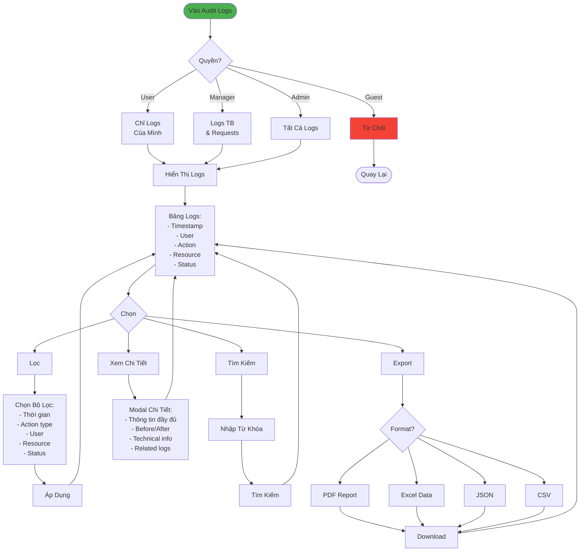

# Luồng Nhật Ký Kiểm Toán (Đơn Giản)

## Tóm Tắt

### Quyền Truy Cập
- **Guest**: Không truy cập được
- **User**: Chỉ logs của mình
- **Manager**: Logs thiết bị & requests
- **Admin**: Tất cả logs

### Log Actions
- Authentication: LOGIN, LOGOUT, PASSWORD_CHANGED
- Equipment: CREATED, UPDATED, DELETED
- Borrow: REQUEST_CREATED, BORROWED, RETURNED
- User: USER_CREATED, ROLE_CHANGED
- System: CONFIG_CHANGED, BACKUP

### Chức Năng

1. **Hiển Thị**
   - Bảng với pagination
   - Timestamp, User, Action, Resource, Status

2. **Lọc**
   - Thời gian (hôm nay, 7 ngày, 30 ngày, custom)
   - Action type (multi-select)
   - User, Resource, Status

3. **Tìm Kiếm**
   - Tìm trong tất cả fields
   - Real-time

4. **Chi Tiết**
   - Full log info
   - Before/After values (diff view)
   - Technical details
   - Related logs timeline

5. **Export**
   - PDF, Excel, JSON, CSV
   - Áp dụng filters hiện tại

### Đặc Điểm
- **Immutable**: Không sửa/xóa logs được
- **Retention**: Lưu 90 ngày (configurable)
- **Security**: RLS, audit trail, compliance
