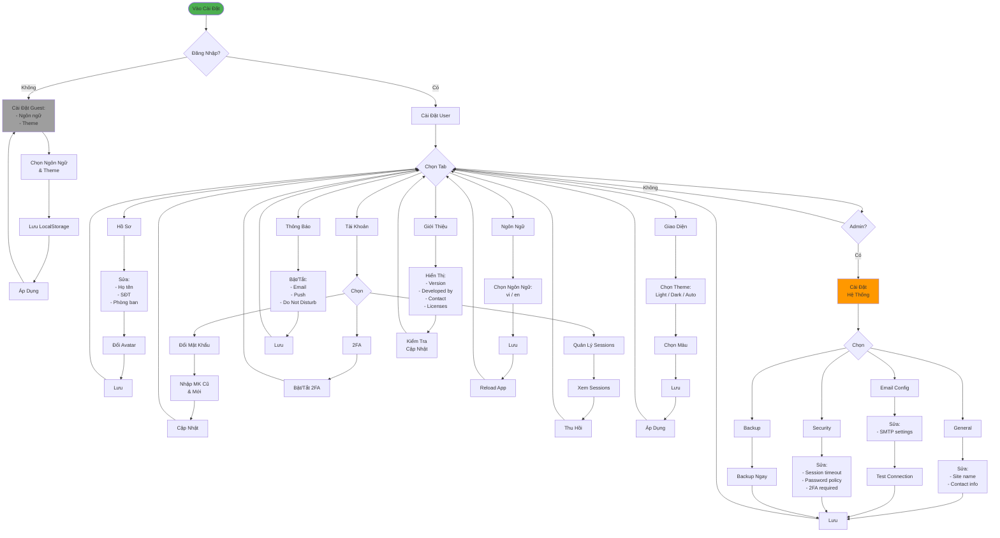

# Luồng Cài Đặt Hệ Thống (Đơn Giản)

## Tóm Tắt

### Cài Đặt Guest (Không Đăng Nhập)
- Ngôn ngữ (vi/en)
- Theme (Light/Dark/System)
- Lưu LocalStorage

### Cài Đặt User (Đã Đăng Nhập)

1. **Hồ Sơ**
   - Sửa thông tin: Tên, SĐT, Phòng ban
   - Đổi avatar (upload/crop)

2. **Tài Khoản & Bảo Mật**
   - Đổi mật khẩu
   - Quản lý sessions (revoke)
   - Xác thực 2 bước (enable/disable)

3. **Ngôn Ngữ**
   - Tiếng Việt / English
   - Date/Number format

4. **Thông Báo**
   - Email notifications (on/off từng loại)
   - Push notifications
   - Do Not Disturb hours

5. **Giao Diện**
   - Theme: Light/Dark/Auto
   - Color scheme: Blue/Green/Purple/Red
   - Font size: Small/Medium/Large
   - Accessibility options

6. **Giới Thiệu**
   - App version & info
   - Check for updates
   - Open source licenses
   - Send feedback

### Cài Đặt Hệ Thống (Admin Only)

1. **General**: Site name, contact, logo
2. **Email**: SMTP configuration, test
3. **Security**: Session, password policy, 2FA
4. **Backup**: Auto backup, manual backup
5. **Maintenance**: Maintenance mode
6. **API**: API keys, rate limits

### Lưu Trữ
- Guest: LocalStorage
- User: Database (users table)
- System: Database (settings table)
